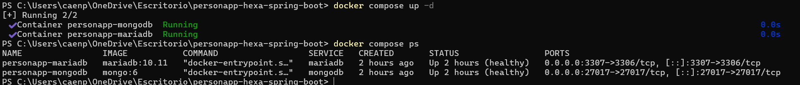
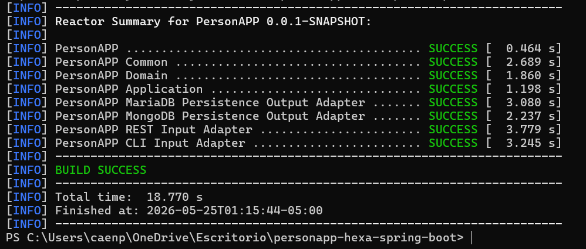
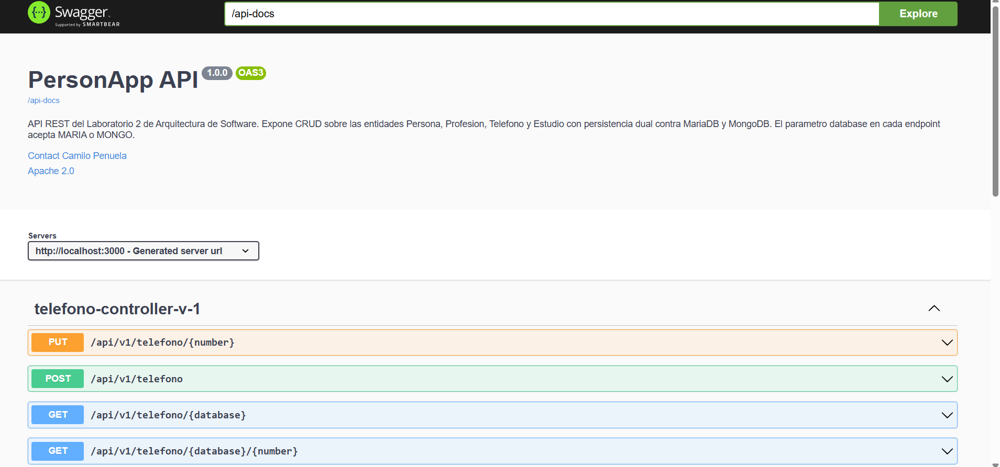
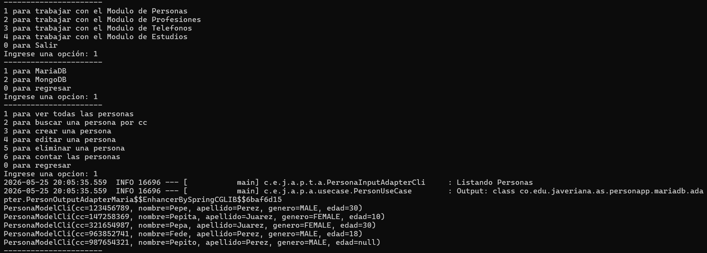
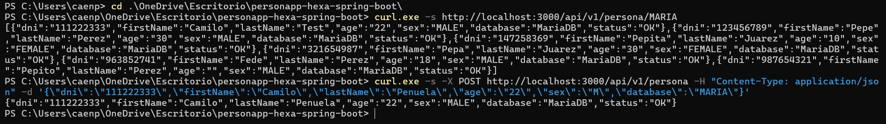

# personapp-hexa-spring-boot

Laboratorio 2 de Arquitectura de Software (Pontificia Universidad Javeriana). Servicio web hexagonal construido con Spring Boot que expone CRUD sobre las entidades **Persona, Profesión, Teléfono y Estudio** con persistencia dual contra **MariaDB** y **MongoDB**, accesible vía **REST** (con Swagger 3) y vía **CLI**.

**Autores:** Camilo Peñuela, Santiago Mesa, xxx

## Tabla de contenidos

1. [Stack](#stack)
2. [Modelo de datos](#modelo-de-datos)
3. [Estructura del proyecto](#estructura-del-proyecto)
4. [Requisitos previos](#requisitos-previos)
5. [Configuración del entorno](#configuración-del-entorno)
6. [Compilación](#compilación)
7. [Despliegue y ejecución](#despliegue-y-ejecución)
8. [Uso de la API REST](#uso-de-la-api-rest)
9. [Uso de la aplicación CLI](#uso-de-la-aplicación-cli)
10. [Ejemplos completos con curl](#ejemplos-completos-con-curl)
11. [Detener el entorno](#detener-el-entorno)

## Stack

| Componente | Versión |
|---|---|
| Java | 11 (compilado con `<maven.compiler.source>11</maven.compiler.source>`, validado también con JDK 17) |
| Spring Boot | 2.7.11 |
| Maven | 3.9.6 (vía Maven Wrapper, no se requiere instalación previa) |
| MariaDB | 10.11 |
| MongoDB | 6 |
| springdoc-openapi-ui | 1.7.0 |
| Lombok | 1.18.26 |
| Docker / Docker Compose | usados para orquestar MariaDB y MongoDB |

## Modelo de datos

Las cuatro entidades requeridas y sus relaciones quedan documentadas en los scripts `scripts/persona_ddl_maria.sql` (MariaDB) y `scripts/persona_ddl_mongo.js` (MongoDB).

| Entidad | Clave primaria | Relaciones |
|---|---|---|
| `persona` | `cc` (INT) | — |
| `profesion` | `id` (INT) | — |
| `telefono` | `num` (VARCHAR) | FK `duenio` → `persona.cc` |
| `estudios` | compuesta `(id_prof, cc_per)` | FK a `profesion.id` y `persona.cc` |

## Estructura del proyecto

Proyecto Maven multi-módulo organizado por capas de la arquitectura hexagonal:

```
personapp-hexa-spring-boot/
├── common/                    Anotaciones y excepciones compartidas
├── domain/                    Modelos de dominio (Person, Phone, Profession, Study, Gender)
├── application/               Puertos de entrada y salida + casos de uso
├── maria-output-adapter/      Entidades JPA, repositorios y adaptadores para MariaDB
├── mongo-output-adapter/      Documentos, repositorios y adaptadores para MongoDB
├── rest-input-adapter/        API REST + Swagger (PersonAppRestApi)
├── cli-input-adapter/         Aplicación de consola (PersonAppCli)
├── scripts/                   DDL y DML para ambas bases
├── docker-compose.yml         Orquestación de MariaDB y MongoDB
├── mvnw / mvnw.cmd            Maven Wrapper
└── pom.xml                    POM raíz
```

## Requisitos previos

Solo se necesitan tres herramientas en la máquina del evaluador:

- **JDK 11 o superior** (probado con Java 11 y Java 17). Verificar con `java -version`.
- **Git** (para clonar el repositorio).
- **Docker Desktop** con Docker Compose v2.x. Verificar con `docker compose version`.

No se requiere instalar Maven (incluido como wrapper) ni MariaDB / MongoDB de forma nativa (se levantan en contenedores).

## Configuración del entorno

### 1. Clonar el repositorio

```bash
git clone https://github.com/caenpes2003/personapp-hexa-spring-boot.git
cd personapp-hexa-spring-boot
```

### 2. Levantar MariaDB y MongoDB con Docker Compose

El archivo `docker-compose.yml` define dos servicios:

- `mariadb`: imagen `mariadb:10.11`, expuesto en el puerto **3307** del host.
- `mongodb`: imagen `mongo:6`, expuesto en el puerto **27017** del host.

Ambos servicios montan los scripts de `scripts/` como `docker-entrypoint-initdb.d`, de modo que al primer arranque crean automáticamente el esquema, el usuario `persona_db` y los datos semilla.

```bash
docker compose up -d
```

Verificar que ambos contenedores quedaron en estado `healthy`:

```bash
docker compose ps
```

Salida esperada:

```
NAME                IMAGE           STATUS
personapp-mariadb   mariadb:10.11   Up X minutes (healthy)
personapp-mongodb   mongo:6         Up X minutes (healthy)
```

> 
> *Pendiente: capturar `docker compose ps` mostrando ambos contenedores healthy.*

### 3. Variables de configuración

Las credenciales y URLs ya están definidas en `rest-input-adapter/src/main/resources/application.properties` y en `cli-input-adapter/src/main/resources/application.properties`:

| Parámetro | Valor |
|---|---|
| `server.port` (REST) | 3000 |
| MariaDB host:puerto | `localhost:3307` |
| MariaDB base / usuario / contraseña | `persona_db / persona_db / persona_db` |
| MongoDB host:puerto | `localhost:27017` |
| MongoDB base | `persona_db` |
| MongoDB usuario / contraseña / auth-db | `persona_db / persona_db / admin` |

No es necesario modificar nada si MariaDB y MongoDB se levantan con el `docker-compose.yml` provisto.

## Compilación

Desde la raíz del proyecto, ejecutar el wrapper de Maven. El primer arranque descarga Maven 3.9.6 y todas las dependencias (~150 MB).

En Windows:

```powershell
.\mvnw.cmd -DskipTests clean install
```

En Linux / macOS:

```bash
./mvnw -DskipTests clean install
```

Resultado esperado:

```
[INFO] PersonAPP .......................................... SUCCESS
[INFO] PersonAPP Common ................................... SUCCESS
[INFO] PersonAPP Domain ................................... SUCCESS
[INFO] PersonAPP Application .............................. SUCCESS
[INFO] PersonAPP MariaDB Persistence Output Adapter ....... SUCCESS
[INFO] PersonAPP MongoDB Persistence Output Adapter ....... SUCCESS
[INFO] PersonAPP REST Input Adapter ....................... SUCCESS
[INFO] PersonAPP CLI Input Adapter ........................ SUCCESS
[INFO] BUILD SUCCESS
```

Los `jar` ejecutables quedan en:

- `rest-input-adapter/target/rest-input-adapter-0.0.1-SNAPSHOT.jar`
- `cli-input-adapter/target/cli-input-adapter-0.0.1-SNAPSHOT.jar`

> 
> *Pendiente: capturar la salida de `mvnw -DskipTests clean install` mostrando BUILD SUCCESS.*

## Despliegue y ejecución

### API REST

```bash
java -jar rest-input-adapter/target/rest-input-adapter-0.0.1-SNAPSHOT.jar
```

La aplicación arranca en `http://localhost:3000`. Cuando aparece la línea `Started PersonAppRestApi in X seconds` está lista para recibir peticiones.

- **Swagger UI:** http://localhost:3000/swagger-ui.html
- **OpenAPI JSON:** http://localhost:3000/api-docs

> 
> *Pendiente: capturar la pantalla principal de Swagger UI con los 24 endpoints.*

### Aplicación CLI

```bash
java -jar cli-input-adapter/target/cli-input-adapter-0.0.1-SNAPSHOT.jar
```

El CLI muestra un menú interactivo. Ver la sección [Uso de la aplicación CLI](#uso-de-la-aplicación-cli) más abajo para el detalle de la navegación.

## Uso de la API REST

Para todos los endpoints, el parámetro `{database}` acepta los valores `MARIA` o `MONGO` (case-insensitive).

### Persona

| Método | Ruta | Descripción |
|---|---|---|
| GET | `/api/v1/persona/{database}` | Listar todas |
| GET | `/api/v1/persona/{database}/{cc}` | Buscar por cédula |
| POST | `/api/v1/persona` | Crear |
| PUT | `/api/v1/persona/{cc}` | Editar |
| DELETE | `/api/v1/persona/{database}/{cc}` | Eliminar |
| GET | `/api/v1/persona/{database}/count/total` | Contar |

### Profesión

| Método | Ruta | Descripción |
|---|---|---|
| GET | `/api/v1/profesion/{database}` | Listar todas |
| GET | `/api/v1/profesion/{database}/{id}` | Buscar por id |
| POST | `/api/v1/profesion` | Crear |
| PUT | `/api/v1/profesion/{id}` | Editar |
| DELETE | `/api/v1/profesion/{database}/{id}` | Eliminar |
| GET | `/api/v1/profesion/{database}/count/total` | Contar |

### Teléfono

| Método | Ruta | Descripción |
|---|---|---|
| GET | `/api/v1/telefono/{database}` | Listar todos |
| GET | `/api/v1/telefono/{database}/{number}` | Buscar por número |
| POST | `/api/v1/telefono` | Crear (requiere `ownerCc` válido) |
| PUT | `/api/v1/telefono/{number}` | Editar |
| DELETE | `/api/v1/telefono/{database}/{number}` | Eliminar |
| GET | `/api/v1/telefono/{database}/count/total` | Contar |

### Estudio

| Método | Ruta | Descripción |
|---|---|---|
| GET | `/api/v1/estudio/{database}` | Listar todos |
| GET | `/api/v1/estudio/{database}/{personCc}/{professionId}` | Buscar por clave compuesta |
| POST | `/api/v1/estudio` | Crear (requiere `personCc` y `professionId` válidos) |
| PUT | `/api/v1/estudio/{personCc}/{professionId}` | Editar |
| DELETE | `/api/v1/estudio/{database}/{personCc}/{professionId}` | Eliminar |
| GET | `/api/v1/estudio/{database}/count/total` | Contar |

## Uso de la aplicación CLI

El CLI funciona como menú interactivo. La navegación tiene tres niveles:

1. **Menú principal:** seleccionar entidad (1 Persona, 2 Profesión, 3 Teléfono, 4 Estudio, 0 Salir).
2. **Selector de motor de persistencia:** 1 para MariaDB, 2 para MongoDB, 0 para regresar.
3. **Operaciones disponibles:** 1 para listar todos los registros, 0 para regresar.

Ejemplo de sesión que lista las personas almacenadas en MariaDB:

```
1 para trabajar con el Modulo de Personas
2 para trabajar con el Modulo de Profesiones
3 para trabajar con el Modulo de Telefonos
4 para trabajar con el Modulo de Estudios
0 para Salir
Ingrese una opcion: 1
----------------------
1 para MariaDB
2 para MongoDB
0 para regresar
Ingrese una opcion: 1
----------------------
1 para ver todas las personas
0 para regresar
Ingrese una opcion: 1
PersonaModelCli(cc=123456789, nombre=Pepe, apellido=Perez, genero=MALE, edad=30)
PersonaModelCli(cc=147258369, nombre=Pepita, apellido=Juarez, genero=FEMALE, edad=10)
...
```

> 
> *Pendiente: capturar una sesión del CLI listando personas desde MariaDB.*

## Ejemplos completos con curl

Todos los comandos asumen que la API REST está corriendo en `http://localhost:3000`.

### Persona

```bash
# 1. Listar personas en MariaDB
curl -s http://localhost:3000/api/v1/persona/MARIA

# 2. Buscar una persona por cc en MariaDB
curl -s http://localhost:3000/api/v1/persona/MARIA/123456789

# 3. Crear una persona en MariaDB
curl -s -X POST http://localhost:3000/api/v1/persona \
  -H "Content-Type: application/json" \
  -d '{"dni":"111222333","firstName":"Camilo","lastName":"Penuela","age":"22","sex":"M","database":"MARIA"}'

# 4. Editar una persona
curl -s -X PUT http://localhost:3000/api/v1/persona/111222333 \
  -H "Content-Type: application/json" \
  -d '{"dni":"111222333","firstName":"Camilo Alberto","lastName":"Penuela","age":"23","sex":"M","database":"MARIA"}'

# 5. Eliminar una persona en MariaDB
curl -s -X DELETE http://localhost:3000/api/v1/persona/MARIA/111222333

# 6. Contar personas en MariaDB
curl -s http://localhost:3000/api/v1/persona/MARIA/count/total
```

### Profesión

```bash
# 7. Listar profesiones en MongoDB
curl -s http://localhost:3000/api/v1/profesion/MONGO

# 8. Buscar profesion por id en MongoDB
curl -s http://localhost:3000/api/v1/profesion/MONGO/100

# 9. Crear profesion en MariaDB
curl -s -X POST http://localhost:3000/api/v1/profesion \
  -H "Content-Type: application/json" \
  -d '{"identification":"100","name":"Ingeniero","description":"Ingeniero de Sistemas","database":"MARIA"}'

# 10. Editar profesion
curl -s -X PUT http://localhost:3000/api/v1/profesion/100 \
  -H "Content-Type: application/json" \
  -d '{"identification":"100","name":"Ingeniero Senior","description":"Con experiencia","database":"MARIA"}'

# 11. Eliminar profesion en MariaDB
curl -s -X DELETE http://localhost:3000/api/v1/profesion/MARIA/100

# 12. Contar profesiones en MongoDB
curl -s http://localhost:3000/api/v1/profesion/MONGO/count/total
```

### Teléfono

El cuerpo del request requiere `ownerCc` que debe existir como cédula de una persona en la base seleccionada; si no existe, el teléfono no se persiste y se devuelve el payload de entrada con `status` distinto a `"OK"`.

```bash
# 13. Listar telefonos en MariaDB
curl -s http://localhost:3000/api/v1/telefono/MARIA

# 14. Buscar telefono por numero en MongoDB
curl -s http://localhost:3000/api/v1/telefono/MONGO/3001234567

# 15. Crear telefono en MariaDB (dueno cc 123456789 ya existe en el seed)
curl -s -X POST http://localhost:3000/api/v1/telefono \
  -H "Content-Type: application/json" \
  -d '{"number":"3001234567","company":"Claro","ownerCc":"123456789","database":"MARIA"}'

# 16. Editar telefono
curl -s -X PUT http://localhost:3000/api/v1/telefono/3001234567 \
  -H "Content-Type: application/json" \
  -d '{"number":"3001234567","company":"Tigo","ownerCc":"123456789","database":"MARIA"}'

# 17. Eliminar telefono en MariaDB
curl -s -X DELETE http://localhost:3000/api/v1/telefono/MARIA/3001234567

# 18. Contar telefonos en MongoDB
curl -s http://localhost:3000/api/v1/telefono/MONGO/count/total
```

### Estudio

La clave primaria de Estudio es la combinación (`personCc`, `professionId`). Ambos deben existir previamente como `persona.cc` y `profesion.id` en la base seleccionada.

```bash
# 19. Listar estudios en MariaDB
curl -s http://localhost:3000/api/v1/estudio/MARIA

# 20. Buscar estudio por clave compuesta en MariaDB
curl -s http://localhost:3000/api/v1/estudio/MARIA/123456789/100

# 21. Crear estudio en MariaDB
curl -s -X POST http://localhost:3000/api/v1/estudio \
  -H "Content-Type: application/json" \
  -d '{"personCc":"123456789","professionId":"100","graduationDate":"2020-12-15","universityName":"Javeriana","database":"MARIA"}'

# 22. Editar estudio
curl -s -X PUT http://localhost:3000/api/v1/estudio/123456789/100 \
  -H "Content-Type: application/json" \
  -d '{"personCc":"123456789","professionId":"100","graduationDate":"2021-01-15","universityName":"Andes","database":"MARIA"}'

# 23. Eliminar estudio en MariaDB
curl -s -X DELETE http://localhost:3000/api/v1/estudio/MARIA/123456789/100

# 24. Contar estudios en MongoDB
curl -s http://localhost:3000/api/v1/estudio/MONGO/count/total
```

> 
> *Pendiente: capturar la terminal con un par de ejemplos de curl ejecutados o un Postman con la colección de endpoints.*

## Detener el entorno

Detener la API REST o el CLI con `Ctrl+C` en la terminal donde se está ejecutando.

Detener los contenedores manteniendo los datos:

```bash
docker compose stop
```

Detener y eliminar contenedores y volúmenes (borra todos los datos sembrados):

```bash
docker compose down -v
```

Al volver a ejecutar `docker compose up -d` después de un `down -v`, los scripts DDL y DML se ejecutan de nuevo y la base queda con los datos semilla originales.
