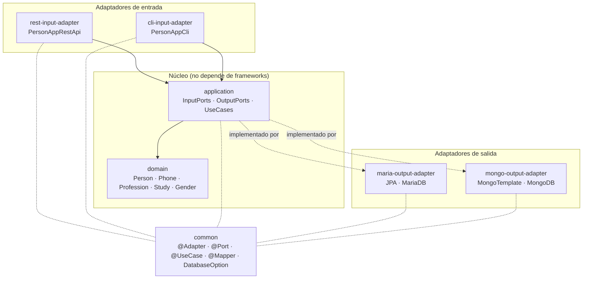
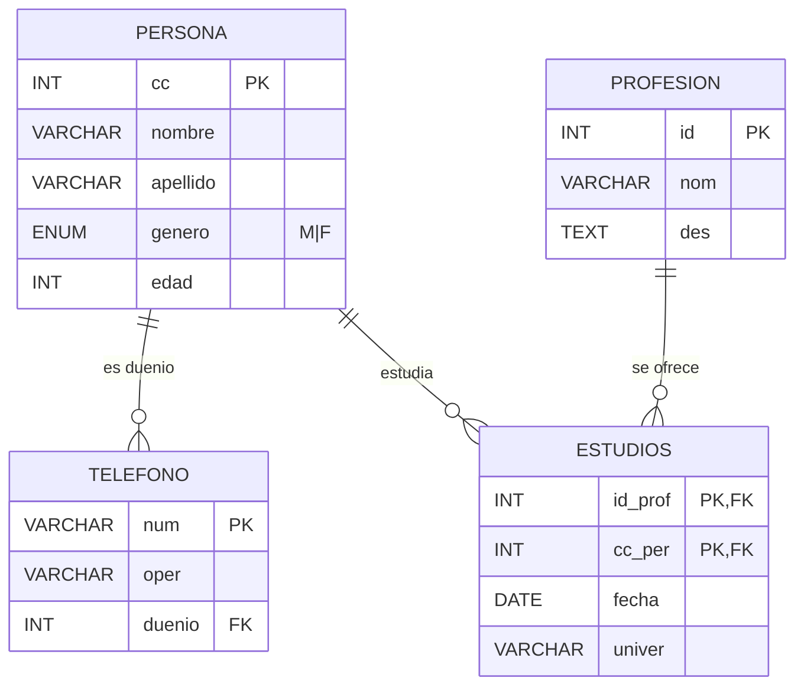
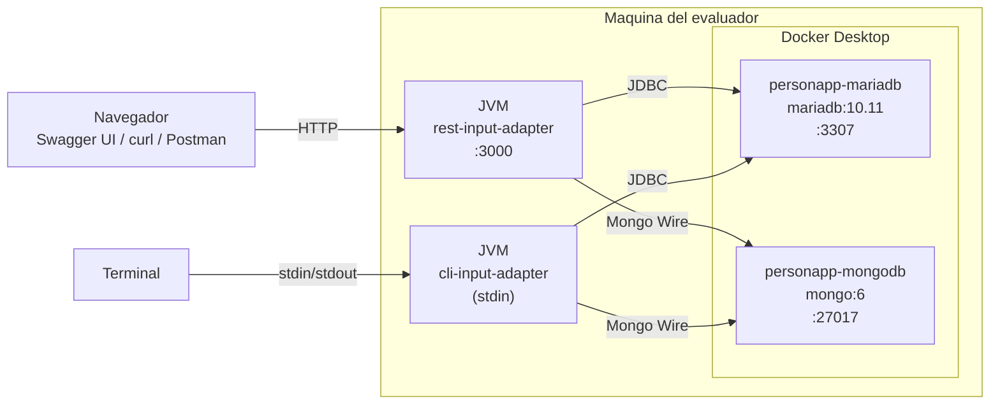
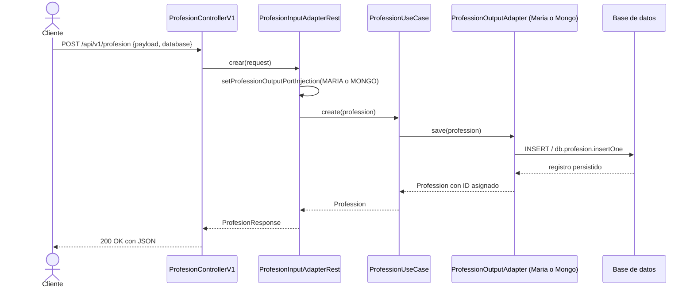
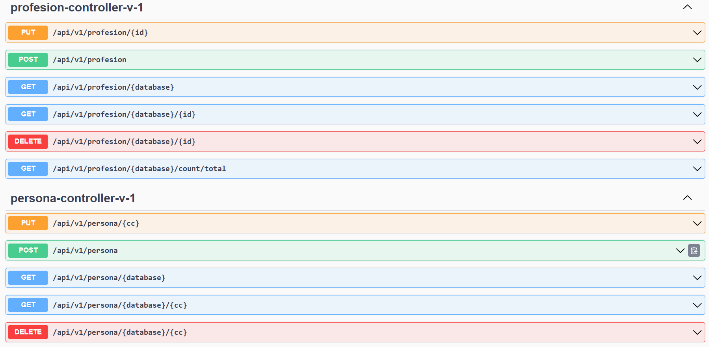

# Reporte Laboratorio 2

**Implementación de Servicio Web en Arquitectura Hexagonal con Repository y Service**

---

## Portada

| | |
|---|---|
| **Asignatura** | Arquitectura de Software |
| **Programa** | Ingeniería de Sistemas |
| **Universidad** | Pontificia Universidad Javeriana |
| **Profesor** | Andrés Sánchez-Martín |
| **Estudiante** | Camilo Peñuela |
| **Correo** | caenpes2003@gmail.com |
| **Laboratorio** | 2 — Servicio Web Hexagonal |
| **Stack solicitado** | JDK 11, Spring Boot, MariaDB, MongoDB, REST, CLI, Swagger 3 |
| **Repositorio** | https://github.com/caenpes2003/personapp-hexa-spring-boot |
| **Versión entregada** | v1.0.0 (ver Releases del repositorio) |
| **Fecha** | Mayo de 2026 |

---

## Tabla de contenidos

1. [Introducción](#1-introducción)
2. [Marco conceptual](#2-marco-conceptual)
3. [Diseño](#3-diseño)
4. [Procedimiento](#4-procedimiento)
5. [Pruebas y validación](#5-pruebas-y-validación)
6. [Conclusiones y lecciones aprendidas](#6-conclusiones-y-lecciones-aprendidas)
7. [Referencias](#7-referencias)

---

## 1. Introducción

El Laboratorio 2 plantea construir un servicio web sobre el modelo de datos de `Persona`, `Profesión`, `Teléfono` y `Estudio`, exponiendo operaciones CRUD a través de dos canales de entrada (REST y CLI) y soportando dos motores de persistencia simultáneamente (MariaDB relacional y MongoDB documental). El objetivo pedagógico es aplicar los principios de arquitectura hexagonal — separación entre dominio, casos de uso y adaptadores — de modo que el dominio quede aislado de detalles tecnológicos y los adaptadores sean intercambiables sin tocar la lógica del negocio.

El punto de partida fue el repositorio plantilla `andres-karoll/personapp-hexa-spring-boot`, que provee el dominio y los adaptadores de Persona como referencia. La entrega consiste en completar los tres dominios restantes (`Profesion`, `Telefono`, `Estudio`) cumpliendo las mismas capas, exponer endpoints REST con Swagger 3, ofrecer una aplicación CLI navegable, levantar el entorno con Docker para reproducibilidad y documentar todo el procedimiento.

---

## 2. Marco conceptual

### 2.1 Arquitectura hexagonal (Ports and Adapters)

La arquitectura hexagonal, propuesta por Alistair Cockburn en 2005, organiza el código en capas concéntricas donde el dominio queda en el centro y los detalles tecnológicos (bases de datos, frameworks web, interfaces de usuario) viven en el borde como adaptadores. La comunicación entre capas se hace a través de **puertos**, que son interfaces declaradas por el dominio y reciben implementaciones concretas en los adaptadores.

El estilo recibe el nombre de "hexagonal" porque la representación visual ubica al dominio en un hexágono y a cada adaptador (uno por canal de entrada o salida) en uno de los lados del hexágono. La elección del polígono es arbitraria; lo importante es que cada lado representa un punto de integración con el mundo exterior.

Los dos tipos de puertos son:

- **Puertos de entrada** (driving ports / primary ports): describen lo que el dominio ofrece al exterior. Un controlador REST o un menú CLI llaman a estos puertos para ejecutar casos de uso.
- **Puertos de salida** (driven ports / secondary ports): describen lo que el dominio necesita del exterior. Un repositorio JPA o un repositorio MongoDB son adaptadores de un mismo puerto de salida `XxxOutputPort`.

La ventaja práctica de este estilo es que el dominio no depende de Spring, ni de Hibernate, ni de Mongo, ni del protocolo HTTP. Cualquier cambio tecnológico (por ejemplo, reemplazar MariaDB por PostgreSQL) se resuelve escribiendo un adaptador nuevo sin tocar el dominio.

### 2.2 Patrones Repository y Service

El patrón **Repository**, popularizado por Eric Evans en *Domain-Driven Design*, encapsula el acceso a una colección de objetos del dominio. En este laboratorio cada entidad cuenta con dos repositorios (`XxxRepositoryMaria` y `XxxRepositoryMongo`) que extienden las interfaces de Spring Data (`JpaRepository` y `MongoRepository` respectivamente) y exponen operaciones de persistencia (`save`, `findById`, `findAll`, `deleteById`).

El patrón **Service**, en este contexto materializado en los `UseCase`, orquesta la lógica del caso de uso utilizando uno o más repositorios. Por ejemplo, `PhoneUseCase.create` no se limita a llamar `save`: encapsula la regla "si el dueño no existe, no persistir el teléfono".

La combinación Repository + Service es ortogonal a la arquitectura hexagonal: los servicios son los casos de uso del dominio (capa interna) y los repositorios son los adaptadores de salida (capa externa).

### 2.3 Persistencia políglota

El laboratorio exige que el mismo dominio funcione contra dos bases de datos heterogéneas. MariaDB es un motor relacional con esquema estricto, llaves foráneas y transacciones ACID; MongoDB es un almacén documental sin esquema fijo, donde las relaciones se modelan vía documentos referenciados (`@DocumentReference`) o embebidos.

El mismo modelo de dominio (`Person`, `Phone`, `Profession`, `Study`) se traduce a dos modelos de persistencia distintos:

- En MariaDB: `EstudiosEntity` usa `@EmbeddedId EstudiosEntityPK` para la clave compuesta `(id_prof, cc_per)`, con relaciones `@ManyToOne` resueltas vía `@JoinColumn`.
- En MongoDB: `EstudiosDocument` usa un identificador sintético `String id` con formato `"cc-idProf"` y referencias documentales (`@DocumentReference`) a `PersonaDocument` y `ProfesionDocument`.

La selección del motor en tiempo de ejecución se hace vía el parámetro `database` que cada endpoint recibe del cliente (`MARIA` o `MONGO`). El input adapter REST instancia un `XxxUseCase` con el `OutputAdapterMaria` o el `OutputAdapterMongo` según corresponda, sin que el dominio se entere.

### 2.4 Stack tecnológico

| Componente | Versión | Rol |
|---|---|---|
| Java | 11 (compatible con 17) | Lenguaje de implementación |
| Spring Boot | 2.7.11 | Inversión de control, autoconfiguración, web, data |
| Maven | 3.9.6 (vía wrapper) | Build multi-módulo |
| MariaDB | 10.11 | Motor relacional |
| MongoDB | 6 | Motor documental |
| springdoc-openapi-ui | 1.7.0 | Generación de OpenAPI 3 y UI Swagger |
| Lombok | 1.18.26 | Reducción de boilerplate en POJOs y servicios |
| Docker / Docker Compose | 28.4 / v2.39 | Orquestación de motores de base de datos |

---

## 3. Diseño

### 3.1 Vista de capas

El proyecto se descompone en siete módulos Maven, agrupados según las capas hexagonales:



El módulo `common` contiene únicamente anotaciones y excepciones reutilizadas en el resto del proyecto. Las flechas continuas representan dependencias de compilación. Las flechas punteadas hacia `common` indican uso de anotaciones; las que salen de los adaptadores de salida hacia `application` (`implementado por`) muestran que los adaptadores cumplen contratos definidos en el núcleo.

### 3.2 Modelo de datos



La clave primaria de `estudios` es compuesta `(id_prof, cc_per)`, lo que implica que una misma persona puede registrar varias profesiones (con la respectiva universidad y fecha) y una misma profesión puede ser cursada por varias personas. La misma estructura se traduce a MongoDB con un `_id` sintético `"cc-idProf"` que conserva la propiedad de unicidad.

### 3.3 Diagrama de despliegue



Tanto la aplicación REST como la aplicación CLI son `@SpringBootApplication` independientes que se conectan a los dos motores. Cada motor se ejecuta en su propio contenedor; los scripts DDL y DML se montan como `docker-entrypoint-initdb.d` para que se ejecuten una sola vez al crear el volumen, simulando una instalación productiva.

### 3.4 Flujo de una petición REST típica



El paso clave es el segundo (`setProfessionOutputPortInjection`): el input adapter instancia un nuevo `ProfessionUseCase` con el `OutputAdapter` correspondiente. Spring inyecta ambos adaptadores en tiempo de arranque, pero la selección final se hace en cada petición. Esto permite que un mismo `ProfessionUseCase` no quede atado a un motor, sin necesidad de proxies dinámicos ni de profiles.

### 3.5 Endpoints expuestos

El REST adapter expone 24 endpoints (6 por entidad × 4 entidades). El cuadro condensado:

| Entidad | Listar | Buscar | Crear | Editar | Eliminar | Contar |
|---|---|---|---|---|---|---|
| Persona | `GET /{db}` | `GET /{db}/{cc}` | `POST /` | `PUT /{cc}` | `DELETE /{db}/{cc}` | `GET /{db}/count/total` |
| Profesion | idem | `GET /{db}/{id}` | idem | `PUT /{id}` | `DELETE /{db}/{id}` | idem |
| Telefono | idem | `GET /{db}/{num}` | idem | `PUT /{num}` | `DELETE /{db}/{num}` | idem |
| Estudio | idem | `GET /{db}/{cc}/{idProf}` | idem | `PUT /{cc}/{idProf}` | `DELETE /{db}/{cc}/{idProf}` | idem |

Prefijo común: `/api/v1/<entidad>`. El parámetro `{db}` acepta `MARIA` o `MONGO`. Toda la API está documentada en Swagger UI en `http://localhost:3000/swagger-ui.html`.

---

## 4. Procedimiento

### 4.1 Preparación del repositorio

Se creó un repositorio nuevo `caenpes2003/personapp-hexa-spring-boot` y se importó la estructura base del template del profesor (módulos, dominio y adaptadores de Persona). El primer commit (`chore: estructura base hexagonal multi-modulo con dominio y adaptador de Persona`) refleja ese punto de partida y a partir de allí se construye el resto.

Para reproducibilidad se añadieron:

- **Maven Wrapper** anclado a Apache Maven 3.9.6 (`mvnw`, `mvnw.cmd`, `.mvn/wrapper/maven-wrapper.properties`) de modo que el evaluador no necesite tener Maven instalado.
- **`docker-compose.yml`** con servicios `mariadb` (puerto 3307) y `mongodb` (puerto 27017), credenciales `persona_db / persona_db`, volúmenes persistentes y montaje de los scripts SQL/JS como `docker-entrypoint-initdb.d` para que la inicialización sea automática.
- **`.gitignore`** que excluye artefactos de Maven (`target/`), de IDE (`.idea/`, `.vscode/`), logs y bitácoras de build manuales.

> Captura del entorno levantado:
> 

### 4.2 Implementación de las entidades faltantes

Cada entidad (`Profesion`, `Telefono`, `Estudio`) se implementó replicando el patrón completo del dominio de `Persona` ofrecido por el template. Para cada una se generaron 12 archivos repartidos así:

| Capa | Archivos por entidad |
|---|---|
| `application` | `XxxInputPort`, `XxxOutputPort`, `XxxUseCase` |
| `maria-output-adapter` | `XxxRepositoryMaria`, `XxxOutputAdapterMaria` |
| `mongo-output-adapter` | `XxxRepositoryMongo`, `XxxOutputAdapterMongo` |
| `rest-input-adapter` | `XxxRequest`, `XxxResponse`, `XxxMapperRest`, `XxxInputAdapterRest`, `XxxControllerV1` |

Notas particulares de cada entidad:

- **Profesion**: la entidad más simple, sin llaves foráneas. Sirvió como banco de pruebas para el patrón.
- **Telefono**: tiene una llave foránea hacia `Persona`. El adaptador de salida consulta primero la persona dueña en el repositorio (`findById(ownerCc)`) y, solo si existe, ensambla el `TelefonoEntity` con la referencia gestionada y lo guarda. Si la persona no existe, la operación se aborta y se registra una advertencia en el log.
- **Estudio**: clave compuesta `(cc, idProf)` y dos llaves foráneas. El input port y el use case reciben los dos componentes de la clave por separado, y el adaptador valida la existencia de las dos entidades referenciadas antes de persistir.

### 4.3 Selección dinámica del motor de persistencia

Cada input adapter (REST y CLI) tiene dos `@Qualifier` inyectados, uno por motor (`xxxOutputAdapterMaria` y `xxxOutputAdapterMongo`). El método `setXxxOutputPortInjection(String dbOption)` evalúa el parámetro `database` recibido en cada petición y construye un `XxxUseCase` con el adaptador correspondiente. Este patrón es el mismo que el template aplica para `Persona` y se replicó tal cual en las tres entidades nuevas para mantener consistencia.

### 4.4 Aplicación CLI

El CLI parte del esqueleto provisto por el template (`MenuPrincipal`, `PersonaMenu`, `PersonaInputAdapterCli`, etc.) y se extiende con tres menús nuevos (`ProfesionMenu`, `TelefonoMenu`, `EstudioMenu`) cableados en `MenuPrincipal`. La navegación está estructurada en tres niveles:

1. Selección de entidad (1 Persona, 2 Profesión, 3 Teléfono, 4 Estudio, 0 Salir).
2. Selección de motor (1 MariaDB, 2 MongoDB, 0 Regresar).
3. Operación (1 Listar, 0 Regresar).

En esta entrega el CLI solo expone la operación de listar para las cuatro entidades. La cobertura de crear, editar y eliminar via CLI quedó como pregunta abierta para el profesor, dado que el CRUD completo ya está validado por REST y replicarlo con `Scanner.nextInt()` agregaría volumen de código sin valor funcional nuevo.

> Captura del CLI ejecutándose:
> 

### 4.5 Documentación de la API con Swagger

El template trae `springdoc-openapi-ui` en el classpath pero no configura ningún `@Bean OpenAPI`, por lo que la UI cargaba con metadatos genéricos. Se añadió `OpenApiConfig` en el módulo REST con título, versión, descripción del laboratorio, datos de contacto y licencia, de modo que Swagger UI presenta la API con identidad propia.

> Captura de Swagger UI:
> 
> 

### 4.6 Datos de prueba

Los scripts DDL crean el esquema y el usuario `persona_db` con permisos sobre la base homónima. Los scripts DML siembran un conjunto pequeño pero relacionado de datos que permite probar todos los endpoints sin tener que crear registros manualmente:

| Entidad | Cantidad en cada base | Ejemplo |
|---|---|---|
| Persona | 5 | Pepe, Pepito, Pepa, Pepita, Fede |
| Profesion | 3 | Ingeniero de Sistemas, Médico, Abogado |
| Telefono | 3 | Cada teléfono asociado a una persona del seed |
| Estudio | 3 | Cada estudio combina una persona y una profesión existentes |

### 4.7 Compilación y despliegue

La compilación se realiza con `./mvnw -DskipTests clean install` desde la raíz, produciendo dos JARs ejecutables (`rest-input-adapter-0.0.1-SNAPSHOT.jar` y `cli-input-adapter-0.0.1-SNAPSHOT.jar`) gracias al plugin `spring-boot-maven-plugin` configurado en los dos módulos ejecutables. El despliegue local consiste en `docker compose up -d` para levantar las bases de datos seguido de `java -jar ...` para arrancar la API o el CLI.

> Captura de la compilación:
> 

---

## 5. Pruebas y validación

### 5.1 Estrategia

La validación se hizo en tres niveles:

1. **Compilación**: cada módulo debe compilar y los 8 módulos del reactor deben producir `BUILD SUCCESS`.
2. **Arranque**: las dos aplicaciones (REST y CLI) deben arrancar sin excepciones, conectándose simultáneamente a MariaDB y a MongoDB.
3. **Pruebas funcionales**: cada uno de los 24 endpoints REST se probó manualmente con `curl` contra ambas bases. El CLI se probó navegando hasta el listado de las cuatro entidades en cada motor.

### 5.2 Ejemplo de validación end-to-end

Secuencia ejecutada contra el servicio REST con el seed cargado:

```
GET  /api/v1/persona/MARIA          -> lista las 5 personas
POST /api/v1/persona                -> crea persona en MariaDB
GET  /api/v1/persona/MARIA/{cc}     -> retorna la persona creada
PUT  /api/v1/persona/{cc}           -> edita la persona
DELETE /api/v1/persona/MARIA/{cc}   -> retorna true y la elimina
```

La misma secuencia se ejecutó cambiando el parámetro `database` a `MONGO` y los resultados fueron equivalentes, con la respuesta indicando `"database":"MongoDB"`.

> Captura de una sesión de pruebas con curl:
> 

### 5.3 Verificación de relaciones

Para validar las llaves foráneas se ejecutaron escenarios cruzados:

- Crear un teléfono en MariaDB con `ownerCc` inexistente: el servicio responde con el payload de entrada y log de advertencia; el teléfono no se persiste.
- Crear un estudio en MongoDB con `professionId` inexistente: mismo comportamiento, no se inserta nada.
- Listar teléfonos: la respuesta incluye `ownerName` resuelto, comprobando que la referencia se materializa correctamente.

---

## 6. Conclusiones y lecciones aprendidas

### 6.1 Sobre la arquitectura hexagonal

La separación entre dominio y adaptadores demostró su valor a medida que se sumaron entidades nuevas. Implementar `Profesion`, `Telefono` y `Estudio` siguió un patrón mecánico exactamente paralelo al de `Persona`: por cada entidad se replicaron las mismas tres capas y los mismos cinco tipos de clase. Esa simetría es una señal de que el estilo arquitectónico está bien aplicado.

El precio que se paga por esta simetría es la verbosidad: cada entidad terminó requiriendo unos 12 archivos. Para un dominio pequeño como este, el costo es asumible y se gana mantenibilidad. Para un dominio grande, habría que valorar el uso de generación de código o de abstracciones intermedias.

### 6.2 Sobre la persistencia políglota

El mismo dominio convive con dos motores radicalmente distintos sin que la lógica de negocio se vea afectada. El secreto es que los adaptadores de salida conocen las particularidades de su motor (clave compuesta con `@EmbeddedId` en Maria, identificador sintético en Mongo) pero el `UseCase` opera siempre sobre objetos de dominio neutrales.

Una observación práctica: cuando un dominio tiene relaciones bidireccionales (Persona ↔ Telefono ↔ Estudio), los mapeos entrada-salida tienen que romper el ciclo de alguna manera, porque de otro modo cualquier consulta termina en una recursión infinita. La estrategia que se aplicó fue construir "stubs" con los campos primitivos del lado relacionado (`identification`, `firstName`, `lastName`) sin atravesar de vuelta hacia la lista de hijos. Es una decisión que parece menor pero condiciona la usabilidad de toda la cadena.

### 6.3 Sobre las herramientas

Maven Wrapper, Docker Compose y Spring Boot Starters simplifican enormemente la entrega. El evaluador necesita únicamente JDK, Git y Docker: con esos tres ingredientes el repositorio se levanta sin instalar Maven, MariaDB ni MongoDB de forma nativa, y los datos de prueba quedan sembrados automáticamente. Este nivel de reproducibilidad es algo que vale la pena estandarizar en proyectos académicos.

Spring Boot 2.7.11 corrió sin incidentes tanto con JDK 11 como con JDK 17, lo que da margen al evaluador para usar cualquiera de las dos versiones de Java.

### 6.4 Sobre el proceso

Aplicar el flujo "rama main + commits granulares con autoría única + mensajes profesionales" facilita la revisión humana y deja una bitácora del proyecto que sirve como evidencia adicional al documento. El historial del repositorio puede recorrerse para entender cómo se construyó cada pieza, qué decisiones técnicas se tomaron y en qué orden, sin tener que adivinar a partir del estado final del código.

### 6.5 Lecciones aprendidas

- **Documentar el setup desde el primer commit** elimina muchas horas de fricción cuando el proyecto pasa de manos. Un `README` minimalista es deuda técnica.
- **Tener un seed reproducible** (DDL + DML + Docker) es la diferencia entre un proyecto que "funciona en mi máquina" y uno que funciona en la del evaluador.
- **Replicar patrones es mejor que improvisar**: cuando el template ya define cómo se ve un input adapter, un mapper o un use case, lo más seguro es seguir esa misma forma para las entidades nuevas.
- **Pequeños commits coherentes** permiten revertir, revisar y discutir cambios con mucho menos esfuerzo que un commit gigante "implementé todo".

---

## 7. Referencias

1. Cockburn, Alistair. *Hexagonal architecture (Ports and Adapters)*. 2005. <https://alistair.cockburn.us/hexagonal-architecture/>
2. Evans, Eric. *Domain-Driven Design: Tackling Complexity in the Heart of Software*. Addison-Wesley, 2003.
3. VMware. *Spring Boot Reference Documentation, version 2.7.11*. <https://docs.spring.io/spring-boot/docs/2.7.11/reference/htmlsingle/>
4. Pivotal. *Spring Data JPA Reference Documentation*. <https://docs.spring.io/spring-data/jpa/docs/current/reference/html/>
5. MongoDB Inc. *Spring Data MongoDB Reference Documentation*. <https://docs.spring.io/spring-data/mongodb/docs/current/reference/html/>
6. springdoc-openapi. *springdoc-openapi v1.7.0 documentation*. <https://springdoc.org/v1/>
7. MariaDB Foundation. *MariaDB Server Documentation*. <https://mariadb.com/kb/en/documentation/>
8. MongoDB Inc. *MongoDB Manual*. <https://www.mongodb.com/docs/manual/>
9. Docker Inc. *Docker Compose specification*. <https://docs.docker.com/compose/compose-file/>
10. Sanchez-Martin, Andres. *Plantilla del Laboratorio 2 — personapp-hexa-spring-boot*. Pontificia Universidad Javeriana. <https://github.com/andres-karoll/personapp-hexa-spring-boot>
